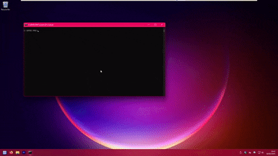

# BYOE-POC
Bring Your Own Emulator (BYOE) - A POC For Using DOSBox For Cloaking Malware Files Under Windows.

# Q & A
Q: Why DOSBox?

A: We Use DOSBox So All Malware Files Can Live Inside A Virtual Disk Image.
The Files Not Touching Disk Helps Evade AV / EDR (No Direct Files On Disk) For A Pseudo-Fileless Malware.
Also, The Main Payload Being A DOS/32 Executable Helps Confuse AV / EDR As Well (No PE/NT Headers).

Q: Why DOSBox-X?

A: Standard DOSBox Requires 2 DLLs in Addition To It's Main Exec, And DOSBox-x Doesn't (Reduces File Count & Code Complexity).
It Also Eliminates The Need To Ship A DPMI Server (Usually CWSDPMI.EXE) Inside The Disk Image (Saving ~22K).

Signiture Rules Welcome! (Please Open PRs Adding Them, As I'm Not Familliar With Them).

Q: Why Also A Windows Host Process?

A: So It Can Perform Process Down-Chain Smuggling Over Disk-Backed IPC, And Allow For A C&C To Not be Needed For This POC (Comes With A Command Line Instead).

# Demo (v0.0.2)

